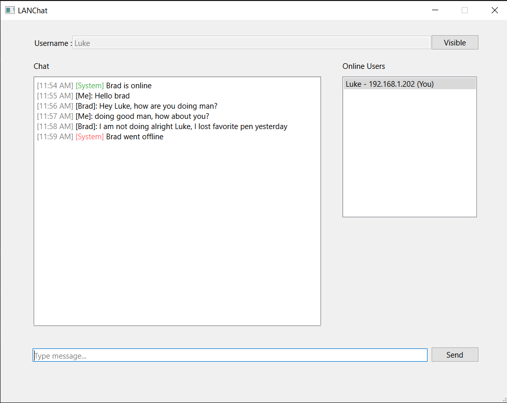
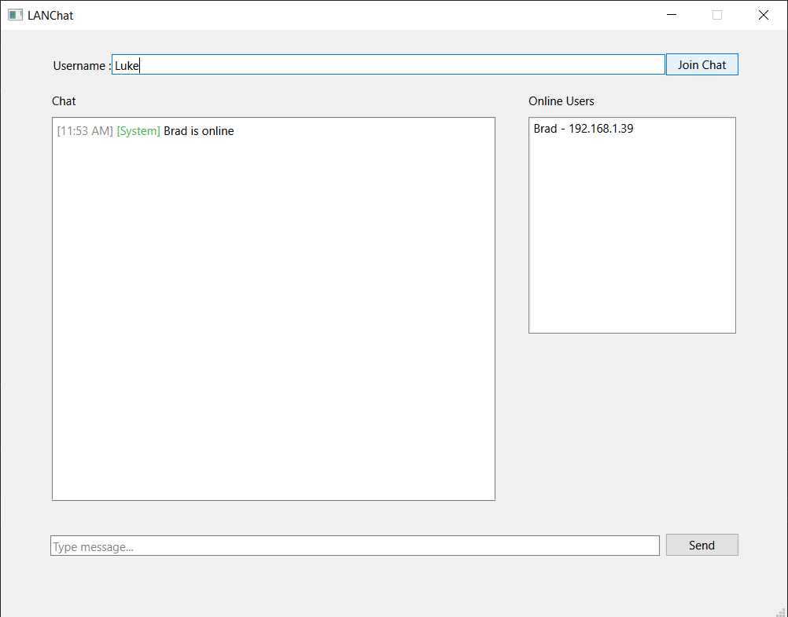
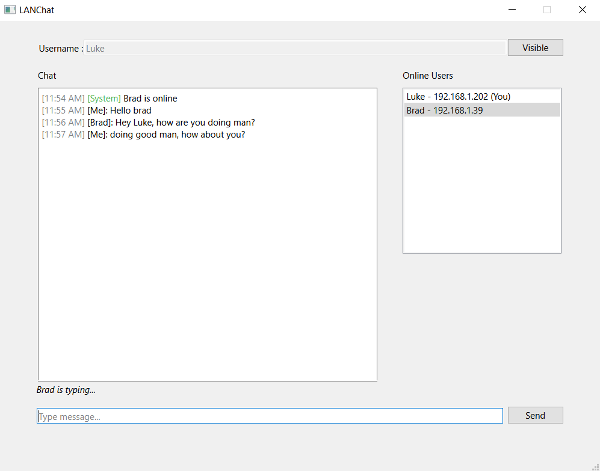

# LANChat

Real-time LAN messaging application built using Qt and C++.

---

# Overview

LANChat is a desktop-based local network messaging application that allows users connected to the same WiFi/LAN network to discover nearby users and communicate in real time.

The application uses:
- UDP broadcasting for nearby user discovery
- TCP sockets for reliable messaging
- Qt Widgets for the graphical user interface

---

# Features

## Nearby User Discovery
- Automatic LAN/WiFi user detection
- Real-time online user updates
- Visibility toggle system (Visible / Hidden)

## Real-Time Messaging
- Instant TCP-based messaging
- Message delivery failure handling
- Self-message prevention

## User Experience Features
- Typing indicators
- Message timestamps
- Online/offline notifications
- Persistent chat history
- Enter key message sending
- Auto-scroll chat window

---

# Technologies Used

- C++
- Qt 6
- Qt Widgets
- QUdpSocket
- QTcpSocket
- QTcpServer
- QTimer

---

# Screenshots

## Main Chat Interface



---

## Join Chat State



---

## User Goes Offline



---

# Project Structure

```text
LANChat/
│
├── src/
├── include/
├── ui/
├── screenshots/
├── README.md
└── CMakeLists.txt
```
